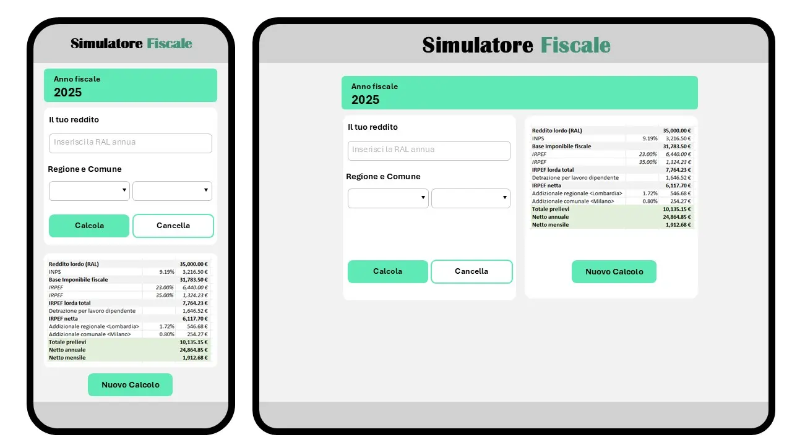
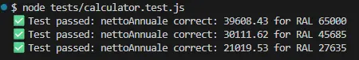

# IT Net Salary Calculator

A simple web-based calculator that estimates the annual and monthly **net salary** (netto) of a full-time permanent employee in Italy, starting from their **gross annual salary** (RAL).

Built as a technical prototype for a Jet HR product builder assessment.

## Scope

Simplified, standard case: full-time permanent employee, resident in Milano (Lombardia), no special tax benefits or Bonus.  
Full assumptions and calculation details will be documented as the project progresses.

## Progress Log

### Research & calculation design

- Researched the Italian gross-to-net salary system: IRPEF (2025 brackets), INPS employee contribution, employee tax credit ("detrazione lavoro dipendente"), regional surtax (Lombardia) and municipal surtax (Milano)
- Validated the full calculation manually in a spreadsheet, using a test case (RAL = €35,000), to confirm formulas and expected results before writing any code
- Decided on tech stack: HTML, Bootstrap (CDN), vanilla JavaScript to keep the calculation logic transparent and the deployment simple (GitHub Pages)
- Decided to test the calculation logic with plain Javascript

### Structure & design

- Set up project structure (flat file layout, no subfolders)
- Created wireframes (mobile + larger screen) in a mobile-first approach, since this type of tool is likely to be checked quickly on a phone
- UI includes Region/Comune dropdowns, structured for future extensibility — but only Lombardia/Milano are implemented and calculable in this prototype. This keeps the calculation logic simple while showing how the data model could scale to other regions.
  

     
Wireframes

     

        
     

  

### Development and calculation logic

- Chose 2025 IRPEF brackets (23%/35%/43%) as the reference year, for a stable dataset
- Excluded "trattamento integrativo" and "ulteriore detrazione" (2025 low/mid-income bonuses) to simplify the prototype
- Fixed at 13 monthly payments (standard Italian practice: tredicesima); a note could explain the tredicesima mechanism next to the monthly net amount
- Regional/municipal data structures (`RATE_REGIONALE`, `RATE_FIX_ADD_COMUNALE`) are keyed by name (e.g. "Lombardia", "Milano") to allow future extension to other regions/comuni, even though only one of each is implemented in this prototype
- `applyBrackets` is a single generic function used for both IRPEF and addizionale regional as both are progressive calculations based on brackets
- `calculateComunaleTax` currently hardcodes "Milano" (would need to accept a comune parameter to support other municipalities)

## Testing

Basic automated tests were added in `tests/calculator.test.js`, validating `calculateNetSalary()` against three reference RAL.

While testing the RAL=27,635€ case, a discrepancy was found between the JS calculation and the original Excel reference. After manual recalculation, the Excel reference itself contained an error and the JavaScript implementation was correct.

  

     
Testing Validation

     

        
     

  

### Areas for Improvement

- Generate results table rows dynamically from `calculateNetSalary()` output length (currently hardcoded per bracket), so adding/removing tax brackets wouldn't require manual HTML changes
- Dynamically compute the displayed tax year instead of hardcoding "2025" (needs to confirm the exact Italian fiscal year reference rule before implementing)

## Tech Stack

- **Frontend:** HTML, CSS (Bootstrap), vanilla JavaScript
- **Testing:**
- **Deployment:** GitHub Pages

## Setup

_TODO once the app is functional_
